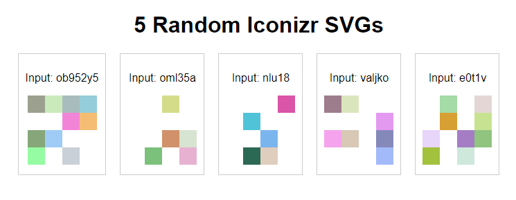

# Iconizr-svg



Iconizr-svg is a customizable SVG icon generator that creates unique, grid-based icons from input strings.

## Features

- **Unique Icon Generation**: Creates distinct icons based on input strings, perfect for user avatars or identicons.
- **Customizable Grid Size**: Adjust the complexity of the icon by changing the grid dimensions.
- **Configurable Icon Size**: Set the overall size of the generated SVG icon.
- **Random Color Generation**: Automatically generates a diverse range of colors for each cell in the grid.
- **Opacity Control**: Fine-tune the visual depth of icons by setting minimum and maximum opacity levels.
- **Consistent Randomness**: Use seed strings to ensure the same input always generates the same icon.
- **SVG Output**: Generate clean, scalable SVG code ready for use in web applications.
- **Lightweight**: Minimal dependencies for easy integration into any project.
- **TypeScript Support**: Fully written in TypeScript for better developer experience and type safety.

## Installation

Install Iconizr using npm:

```
npm install iconizr-svg
```
## Usage

Here's a basic example of how to use iconizr-svg:

javascript
```
import Iconizr from 'iconizr-svg';

const iconizr = new Iconizr({
size: 100,
gridSize: 8,
minOpacity: 0.3,
maxOpacity: 0.9
});

const { svg } = iconizr.generate('example');

console.log(svg);
```

This will output an SVG string that you can use in your application.

## Configuration

When creating a new Iconizr instance, you can pass a configuration object with the following options:

- `size` (number): The size of the generated SVG in pixels. Default: 64
- `gridSize` (number): The number of cells in each row/column of the grid. Default: 5
- `seed` (string): A seed string for consistent random generation. Default: Random string
- `minOpacity` (number): The minimum opacity for cells. Default: 0.2
- `maxOpacity` (number): The maximum opacity for cells. Default: 1.0

## Methods

### generate(input: string): { svg: string }

Generates an SVG icon based on the input string.

- `input`: The input string used to generate the icon.
- Returns an object with an `svg` property containing the SVG string.

## Examples

Generate multiple icons:

javascript
```
const iconizr = new Iconizr({ size: 50, gridSize: 6 });

const icons = [
iconizr.generate('user1'),
iconizr.generate('user2'),
iconizr.generate('user3')
];

icons.forEach(({ svg }, index) => {
console.log(Icon ${index + 1}:, svg);
});
```

## Contributing

Contributions are welcome! Please feel free to submit a Pull Request.

## License

This project is licensed under the MIT License - see the [LICENSE](LICENSE) file for details.
